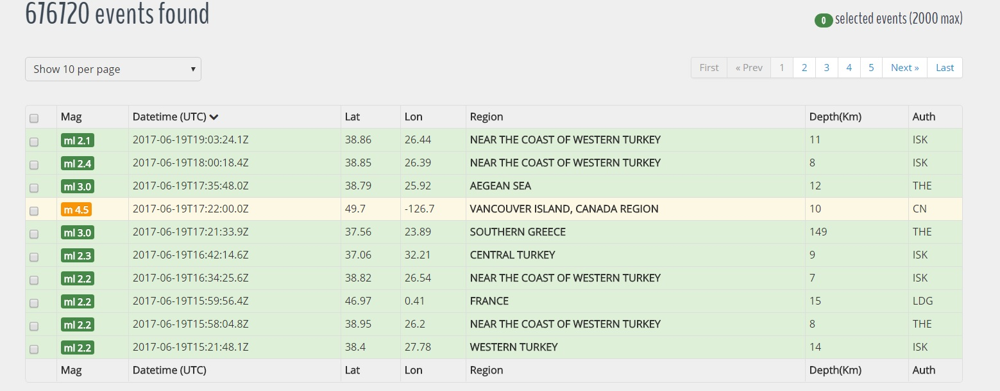
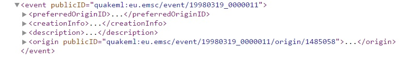
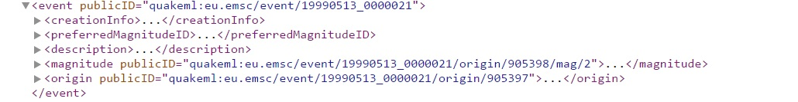
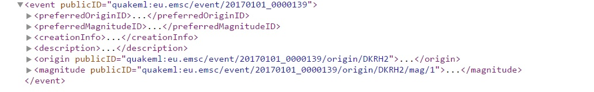
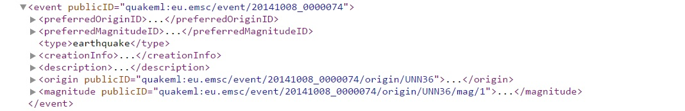
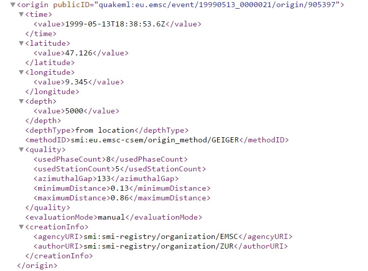
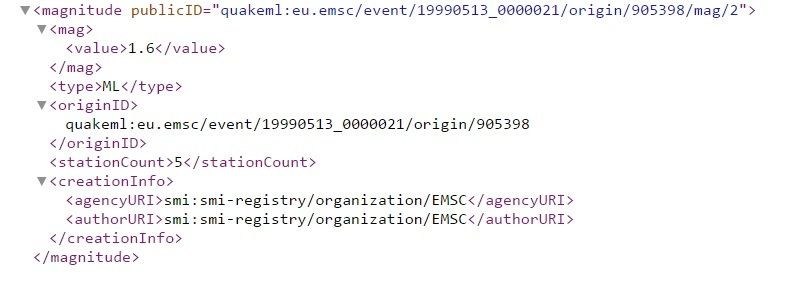
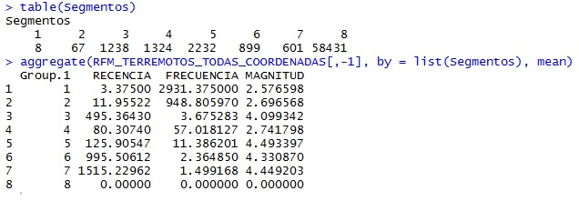

**1.-INTRODUCCIÓN AL PROYECTO.**

La idea de realizar un proyecto de Data Science relacionado con terremotos parte de una clara premisa, o dicho de otro modo, un capricho de la geología. Y es que los eventos sísmicos ocurren en una gran mayoría en los mismos puntos geográficos, a la par que encontramos zonas de la Tierra que apenas sufren la incidencia de estos fenómenos. Así nos encontramos con zonas con alta concentración de eventos como el Anillo de Fuego del Pacífico o el centro del Óceano Atlántico, o países con sismos casi diarios, como Turquía o Italia.

Los algoritmos de Data Science ya están siendo utilizados en la actualidad con el objetivo de predecir movimientos sísmicos, principalmente en Japón y Chile; países con frecuente actividad sísmica y susceptibles de sufrir terremotos de gran magnitud. Hasta disponemos de aplicaciones para móviles para alertar de posibles seísmos.

* http://www.diariosur.es/tecnologia/internet/201602/01/tecnologia-para-adelantarse-terremotos-20160131210406.html
* http://www.chrysalis.cl/blog/puede-el-big-data-predecir-el-proximo-terremoto-2/
* https://play.google.com/store/apps/details?id=com.zizmos.equake&hl=es

El punto de partida para realizar el estudio es un listado de 650.000 terremotos aproximadamente; estos datos han sido obtenidos de la web http://www.seismicportal.eu/. Los terremotos están comprendidos entre 1998 y 2016 en cualquier parte del mundo; con estos datos se ha construido una tabla para posterior tratamiento de los mismos.

¿Y para qué queremos el Data Science con el listado de terremotos? Los objetivos del proyectos son dos principalmente:

* Establecer una segmentación por zonas geográficas de acuerdo a la mayor o menor incidencia de la actividad sísmica.

* Establecer una predicción anual de número de terremotos por zonas geográficas.

Tanto para la segmentación como la predicción usaremos dos criterios para determinar la zona geográfica:

* Coordenadas

* Países

**2.-DESCRIPCIÓN DE LOS DATOS DE ENTRADA.**

Como hemos indicado en el anterior apartado, los datos de los terremotos para realizar el trabajo han sido extraídos de la web http://www.seismicportal.eu/. En este portal disponemos de una relación de terremotos desde 1998 hasta hoy; actualmente podemos encontrar más de 676.000 eventos. Para este proyecto utilizaremos los terremotos comprendidos entre 1998 y 2016. Si accedemos a este portal:

Desde este momento, nuestro primer objetivo es poder visualizar esta información en una tabla, o mejor dicho, en un DataFrame de Python.

El código para la creación del DataFrame de Python se encuentra descrito en el fichero __**web_scrapping_dataset_terremotos.ipynb**__, en la carpeta **python**.

El portal http://www.seismicportal.eu/ nos ofrece varios WebServices para extraer datos de terremotos en formatos JSON, XML y TXT. Usaremos el WebService en XML para extraer estos datos; sin embargo, tiene la limitación de extraer un máximo de 1000 eventos (terremotos) en cada consulta.

Para salvar esta limitación, se llamará al WebService tantas veces como días hay comprendidos entre el 1 de Enero de 1998 y el 31 de Diciembre de 2016 (lo que hace un total de 6940 llamadas); ninguno de esos días supera la limitación de 1000 eventos.

Por ejemplo, la URL del WebService para extraer los terremotos del 15 de Enero de 1998 sería http://www.seismicportal.eu/fdsnws/event/1/query?start=1998-01-15&end=1998-01-16. Para cada llamada al WebService se generará un fichero XML, cuyo nombre para esta misma fecha sería __**1998-01-15_1998-01-16.xml**__. El listado de ficheros XML generados se encuentra alojado en la carpeta __**xml_files**__; en esta carpeta se encuentra un fichero comprimido ZIP por cada año entre 1998 y 2016, incluyendo cada ZIP un fichero XML por cada día.

El siguiente paso sería procesar los ficheros para montar el DataFrame en Python. Aquí debemos realizar un estudio del formato de los ficheros XML; no todos los terremotos tienen los mismos campos, por lo que tendremos que diseñar una función que recupere todos los campos atendiendo a estos diferentes formatos. Principalmente, hemos encontrado 4 formatos distintos.

Además, se han encontrado un pequeño número de ficheros donde aparecían terremotos con formatos específicos. Han sido adaptados para que aparezcan como uno de estos 4 formatos.

Los campos que mas información tienen son "origin" y "magnitude".

El siguiente paso será crear una función que generará los datos de los ficheros XML en una lista de Python; posteriormente, esta lista se convertirá en el DataFrame que usamos como base del proyecto. Guardamos el DataFrame en el fichero __**terremotos.csv.bz2**__, en la carpeta __**files**__.

Una vez tenemos el DataFrame inicial creado, vamos a generar varias columnas para interpretar mejor los datos por estas razones:

* Aparecen varios campos en formatos poco descriptivos, principalmente la fecha y la región del terremoto. Los transformaremos a un formato más amigable.

* Modificaremos latitud y longitud para que aparezcan solo sus partes enteras (sin decimales) e incluiremos ambas en una misma columna.

* Crearemos una función para extraer el país donde se ha producido el terremoto. Coordenadas y países serán de vital importancia para próximas fases del proyecto.

El código para la creación de estas nuevas columnas se encuentra descrito en el fichero __**transformacion_dataset_terremotos**__, en la carpeta __**python**__. Para crear una columna con el nombre del país necesitamos tres ficheros csv adicionales; __**paises.csv**__, __**estados_usa.csv**__ y __**regiones_sin_nombre_pais**__, los tres almacenados en la carpeta __**files**__.

El fichero resultante después de añadir las columnas se encuentra se llama __**terremotos_long.csv.bz2**__, en la carpeta __**files**__. Los XML no se pueden almacenar en GitHub pues ocuparían más de 1Gb, por lo que para ejecutar el proyecto lo idóneo sería partir de uno de los dos ficheros, __**terremotos.csv.bz2**__ ejecutando __**transformacion_dataset_terremotos**__, o directamente __**terremotos_long.csv.bz2**__.

Las columnas del DataFrame se encuentran explicadas en el documento __**Campos_del_dataframe_terremotos.xls**__, en la carpeta __**files**__, en verde aquellas columnas que se crean al importar los datos iniciales; en amarillo, aquellas que se crean posteriormente aplicando funciones a estas mismas columnas iniciales.

**3.-METODOLOGÍA.**

Una vez conocidos lo que van a ser los datos de entrada de nuestro proyecto, llega el momento de "ponerse manos a la obra" con los algoritmos Data Science. Recordamos los objetivos que indicamos en la introducción:

* Establecer una segmentación por zonas geográficas de acuerdo a la mayor o menor incidencia de la actividad sísmica.

* Establecer una predicción anual de número de terremotos por zonas geográficas.

* Tanto la segmentación como la predicción se calcularán atendiendo a dos criterios geográficos: coordenadas y países.

__3.1.-Segmentación de actividad sísmica por zonas geográficas.__

Para realizar la segmentación nos basaremos principalmente en dos algoritmos: el modelo de segmentación RFM y el algoritmo de Clustering (agrupamiento) K-means.

El modelo de segmentación RFM (Recencia, Frecuencia y Monetización) se usa principalmente en marketing para separar entre grupos de clientes dentro de un mercado; aquí lo adaptaremos para el caso de los terremotos.

Pero, ¿en qué consiste la segmentación RFM? Básicamente, se basa en tres criterios bien diferenciados (cada uno de ellos se corresponde con la iniciales RFM):

* __Recencia:__ Tiempo que lleva un cliente sin comprar; en nuestro caso, tiempo que lleva sin producirse un terremoto en una zona geográfica.

* __Frecuencia:__ Número de ocasiones que el cliente compra: en nuestro caso, número de terremotos que suceden en una zona geográfica.

* __Monetización:__ Dinero que gasta el cliente; en nuestro caso, utilizaremos la magnitud de los terremotos en una zona geográfica.

Resumiendo, realizaremos una analogía entre clientes y zonas geográficas (primero coordenadas, luego países) para segmentar cada zona geográfica en base al tiempo que lleva sin producirse un terremoto, el número de terremotos que se producen y la magnitud de los mismos.

Una vez dispongamos de una tabla con valores donde cada coordenada geográfica o país tenga su propia caracterización RFM, pasaremos a aplicar el algoritmo K-means. K-means es un método de aprendizaje no supervisado, muy utilizado para hacer clustering cuando todas las variables son de tipo cuantitativo.

La idea de K-means consiste en crear k centroides (tantos centroides como grupos tengamos) y relacionar cada punto con su centroide más cercano. Una vez se le asigna un centroide a un punto, se vuelven a recalcular los centroides y se vuelven a asignar los puntos al centroide más próximo. Este proceso se sigue repitiendo hasta que llega un punto que no hay cambios en el cálculo de centroides.

Gráficamente:

Primero vamos a realizar la segmentación en base a las coordenadas geográficas. Para calcular la segmentación tenemos que tener una tabla similar a la indicada más abajo, pero con todos los pares de coordenadas correspondientes a longitudes entre -180 y +180, y latitudes entre -90 y +90.

| coordenadas | RECENCIA | FRECUENCIA | MAGNITUD |
| :---------: | :------: | :--------: | :------: |
| -0,-11      | 262      | 1          | 5.1      |
| -0,-16      | 494      | 3          | 4.8      |

Los valores extremos de longitud (-180 y +180) y latitud (-90 y +90) se han modificado por los inmediatamente anteriores; longitud (-179 y +179) y latitud (-89 y +89). Los valores posibles de longitud entre -179 y +179 son 360 (hay que tener en cuenta que tanto para longitud como latitud estarán los valores -0 y +0), y para latitud entre -89 y +89 son 180. Si comprobamos las posibles combinaciones, obtenemos un total de 64800 pares de coordenadas latitud-longitud. Por tanto, buscaremos una tabla de 64800 filas, y 4 columnas (coordenadas, RECENCIA, FRECUENCIA, MAGNITUD).

Para obtener esta tabla seguiremos estos pasos:

* 1) Construiremos una tabla inicial con todos los posibles valores de coordenadas donde Recencia, Frecuencia y Magnitud sean 0.

* 2) A partir de los datos de terremotos, construiremos una tabla con valores Recencia, Frecuencia y Magnitud. Hay que tener en cuenta que no tenemos datos para todos los pares de coordenadas.

* 3) Fusionaremos las dos tablas previas de modo que los pares de coordenadas solo aparezcan una vez.

En el fichero __**coordenadas_RFM_ceros**__ en la carpeta __**python**__ encontramos el código con la tabla inicial de coordenadas con Recencia, Frecuencia y Magnitud a 0. Guardamos el DataFrame creado como __**coordenadas_RFM_ceros.csv**__ en la carpeta __**files**__.

Para construir un DataFrame con Recencia, Frecuencia y Magnitud a partir de los valores de los terremotos tenemos primero que extraer los valores de fecha, coordenadas y magnitud de los terremotos y guardarlos en un fichero. Este código está explicado en el fichero __**coordenadas_RFM_valores**__ en la carpeta __**python**__. Guardamos el fichero generado en __**coordenadas_RFM_valores.csv.bz2**__ en la carpeta __**files**__.

Una vez preparados estos ficheros, haremos la segmentación K-means. En este punto pasaremos a trabajar con R en vez de Python. La segmentación RFM con todas las coordenadas se desarrollará en el fichero __**Segmentacion_RFM_KMeans_coordenadas.R**__ en la carpeta __**R**__. ¿Qué haremos en este fichero? Primeramente, cargaremos los datos de __**coordenadas_RFM_valores.csv.bz2**__ y construiremos una tabla análoga a __**coordenadas_RFM_ceros.csv**__; fusionaremos estas dos tablas y sobre la tabla resultante (donde cada coordenada aparecerá una única vez) aplicaremos K-Means.

Una vez realizado el algoritmo K-means obtenemos 8 segmentos. En el próximo punto de la memoria interpretaremos estos resultados. Los datos con la segmentación RFM y el número de segmento se almacenan en el fichero __**terremotos_coordenadas_RFM**__ en la carpeta __**files**__.

Ahora pasamos a realizar la misma segmentación RFM pero en base a los países donde se producen los terremotos. Como en el caso de las coordenadas, nuestro objetivo será tener una tabla como la de abajo, ahora con países.

| paises      | RECENCIA | FRECUENCIA | MAGNITUD |
| :---------: | :------: | :--------: | :------: |
| ITALY       | 1        | 11596      | 2.52     |
| SPAIN       | 5        | 2164       | 2.83     |   

Para obtener esta tabla seguiremos estos pasos:

* 1) Construiremos una tabla inicial con todos los países donde Recencia, Frecuencia y Magnitud sean 0.

* 2) A partir de los datos de terremotos, construiremos una tabla con valores Recencia, Frecuencia y Magnitud. Hay que tener en cuenta que no tenemos datos para todos los países.

* 3) Fusionaremos las dos tablas previas de modo que los países solo aparezcan una vez.

En el fichero __**paises_RFM_ceros**__ en la carpeta __**python**__ encontramos el código con la tabla inicial de coordenadas con Recencia, Frecuencia y Magnitud a 0. Guardamos el DataFrame creado como __**paises_RFM_ceros.csv**__ en la carpeta __**files**__. El listado de países lo obtenemos del fichero __**paises.csv**__ en la carpeta __**files**__.

Para construir un DataFrame con Recencia, Frecuencia y Magnitud a partir de los valores de los terremotos tenemos primero que extraer los valores de fecha, paises y magnitud de los terremotos y guardarlos en un fichero. Este código está explicado en el fichero __**paises_RFM_valores**__ en la carpeta __**python**__. Guardamos el fichero generado en __**paises_RFM_valores.csv.bz2**__ en la carpeta __**files**__.